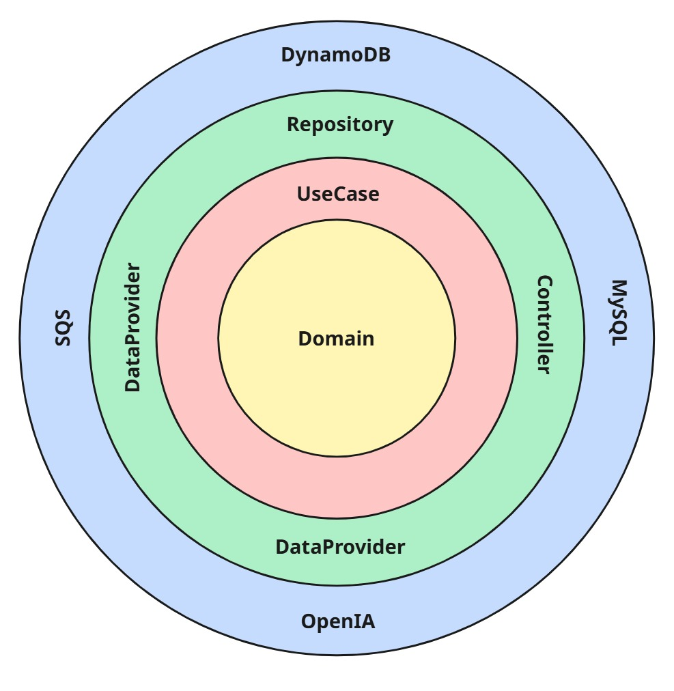

# LeadFlow – API Agente

---

> Uma das API REST do LeadFlow: Lógica de um agente de IA para conversação em chat.
> 

## Sumário

---

## Visão Geral

API responsável pela lógica de agente conversacional

- Recebe mensagens
- Gerencia contextos e conversas
- Integrado a IA para construir resposta de uma conversa

---

## Arquitetura & Domínio

### Estilo arquitetural

- **Clean Architecture** (camadas: EntryPoint → Application → Infrastructure → Domain). O diagrama de camadas está no repositório (veja `docs/arquitetura.jpg`).

**EntryPoint**

- Controllers, DTOs e mappers.

**Application**

- Use cases, gateways (ports), exceções de aplicação.

**Infrastructure**

- Data providers (integração externa com SQS), mappers, repositories (MySQL, DynamoDB), security.

**Domain**

- Entidades/domínios puros (sem dependências de frameworks).

### Domínios principais

- **Conversa**: Conversa entre usuário e agente.
- **Mensagem**: Mensagem recebida dos usuários do cliente.

> Dica visual rápida:
> 



---

## Infraestrutura

- **Hospedagem**: AWS (PaaS) – disponibilidade diária.
- **Persistência**: MySQL + DynamoDB
- **Autenticação**: API Key

---

## Tecnologias & Dependências

- **Linguagem/Framework**: Python 3.11, Fastapi, Uvicorn, SQLAlchermy, Psycopg, PyMySQL
- **Cloud**: AWS SDK v2 (S3)
- **Testes**: Pytest, Coverage

> A lista completa está no requirements.txt
> 

---

## Como Rodar Localmente

**Pré-requisitos**

- Java 17
- Maven 3.9+
- DynamoDB e SQS em execução (LocalStack ou AWS mesmo)
- MySQL

**1) Subir dependências com Docker (exemplo)**

```yaml
version: "3.8"

services:
  mysql:
	  image: mysql:8.4
	  environment:
	    MYSQL_ROOT_PASSWORD: root
	    MYSQL_DATABASE: appdb
	    MYSQL_USER: app
	    MYSQL_PASSWORD: app
	  ports: ["3306:3306"]
    environment:
      POSTGRES_USER: app
      POSTGRES_PASSWORD: app
      POSTGRES_DB: appdb
    healthcheck:
      test: ["CMD-SHELL", "pg_isready -U $$POSTGRES_USER -d $$POSTGRES_DB"]
      interval: 5s
      timeout: 5s
      retries: 20
    volumes:
      - pg_data:/var/lib/postgresql/data
      
  # GUI opcional de banco (funciona p/ Postgres e MySQL)
  adminer:
    image: adminer:latest
    container_name: adminer
    ports:
      - "8081:8080"
    depends_on:
      - postgres

volumes:
  pg_data:
  redis_data:

  
```

**2) Configurar .env/application.properties**

Aponte o S3 para o MinIO (endpoint override) ou use AWS real.

**3) Run**

```bash
python -m venv .venv
source .venv/bin/activate  

pip install -U pip
pip install -r requirements.txt

uvicorn src.entrypoint.main:app --reload --port ${PORT:-8000}

```

**4) Testes & cobertura**

```bash
pytest -q
# Cobertura (terminal)

coverage run -m pytest
coverage report -m

# Cobertura (HTML)
coverage html
# Abra: htmlcov/index.html
```

---

## Testes, Qualidade & Segurança

- **Testes**: JUnit 5 + Mockito; cobertura com JaCoCo.
- **Números atuais** (exemplo do último relatório):
    - **Files**: 98%
    - **Métodos**: 98%
    - **Classes**: 98%

**Autenticação e segurança**

- **Segredos**: 100% via variáveis de ambiente/profiles (dev vs prod).

---

## Observabilidade

- **Logs estruturados** (Logging):
    - erros em *data providers* para falhas externas.
    - info nos principais *use cases* (Conversa, Agente, Mensagem).

---

## API & Contratos

- Integrações externas:
    - OpenIA

**Fluxos chave**

- `/chat` → Recebimento de contexttos

---

## Licença / Uso

Este repositório é **proprietário** e destinado a uso interno do Cotalizer.

**Não** é liberado para uso, cópia, modificação ou distribuição por terceiros sem autorização expressa.

```
Copyright (c) 2025 Cotalizer.
Todos os direitos reservados.

```
